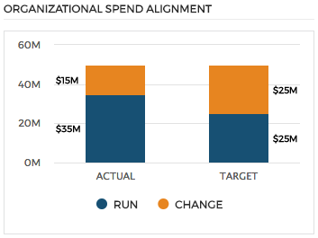

# Organziational Spend Alignment (ITBM Experience)

## Description

This widget can be used to displays a two (2) stacked column chart.

## Screenshots

## Additional Information/Notes
> None
---
## Installation
---
Download and install update set **[pe-itbm-organizational-spend-alignment.u-update-set.xml](https://github.com/platform-experience/serviceportal-widget-library/blob/master/pe-itbm-organizational-spend-alignment/pe-itbm-organizational-spend-alignment.u-update-set.xml)**   
After installation, the widget can be accessed via the `Service Portal > Widgets` section for use and customization. 
* SN Product Documentation - ['Load a customization from a single XML file'](https://docs.servicenow.com/bundle/istanbul-application-development/page/build/system-update-sets/task/t_LoadCustomizationsFromAnXMLFile.html)

---
## Configuration
---
Widget Option Schema parameters:

**Frame Title** Title for the widget card/frame.

---
## Platform Dependencies
---
> None
---
## Sample Data and Data Structures
---
Sample data is provided as JSON objects in the Server Script.

---
## API Dependencies
---
<i>Dependencies are included and configured as part of the provided Update Set.</i>

* HighCharts API (v 5.0.5 - Recommended)  w/Export and No Data plug-ins
   Latest version(s) available from [HighCharts.com](http://http://www.highcharts.com/products/highcharts/)
   Additional HighCharts Utility - [highcharts-ng](https://github.com/pablojim/highcharts-ng) - Angular Directive for HighCharts (__not used or distributed__)

---
## CSS/SASS Variables
---
_CSS/SASS variables are given default values that can be overridden with theming or portal-level CSS._

`$osa-font-color: #2e2e2e !default;` 
`$osa-background-color: #ffffff !default;` 
`$osa-border-color: #E4E5E6 !default;` 