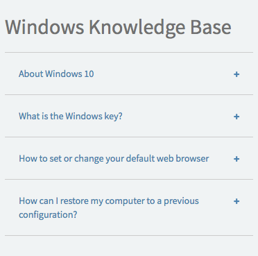
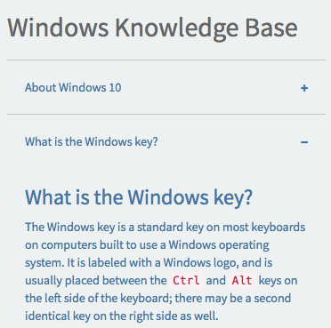

# KB List

## Description

An accordion-style list of Knowledge Base articles from a selected category. Choose an available KB category to display those articles, or define your own category.

## Screenshots

### Collapsed

### Expanded

## Additional Information/Notes

> None

## Installation

Download and install update set **[pe-kb-list.u-update-set.xml](https://github.com/platform-experience/serviceportal-widget-library/blob/master/pe-kb-list/pe-kb-list.u-update-set.xml)**   
After installation, the widget can be accessed via the `Service Portal > Widgets` section for use and customization. 
* SN Product Documentation - ['Load a customization from a single XML file'](https://docs.servicenow.com/bundle/jakarta-application-development/page/build/system-update-sets/task/t_SaveAnUpdateSetAsAnXMLFile.html)

## Configuration

### Widget Option Schema

| Option | Description | Default Value |
| :--- | :--- | :--- |
| `Title` | Sets the header title. | Windows Knowledge Base |
| `KB category` | The Knowledge Base category to display articles from. | Windows |
| `Limit` | Sets the maximum number of KB articles to display. | 5 |

## Platform Dependencies

### SN System Tables

* kb_knowledge

## Sample Data and Data Structures

> See 'Configuration' above

## API Dependencies

<i>Dependencies are included and configured as part of the provided Update Set.</i>

> None

## CSS/SASS Variables

_CSS/SASS variables are given default values that can be overridden with theming or portal-level CSS._

> None