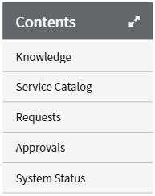
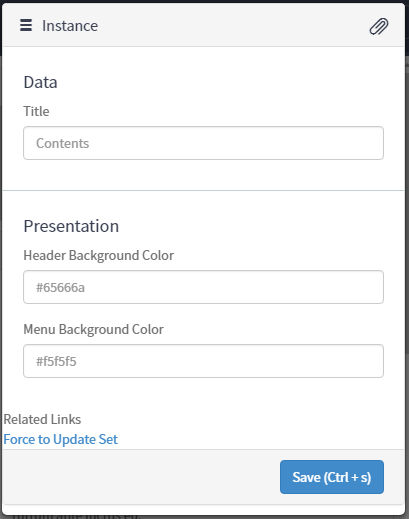

# List Menu - Expand and Collapse

## Description

The ServiceNow Docs site uses a menu on the left side of the page for navigating the various content available in the documentation.  This widget provides that basic feature functionality for generating a list of menu items for navigation.  The intent is to bring the functionality of the component - expand and collapse.  The data items for navigation is left up to the user, however; the widget is coded to use the Service Portal's Main Menu configuration as a starting point for the data.

## Screenshots
### Menu - Expanded

### Menu - Collapsed

### Portal Main Menu Configuration

### Option Schema

---
## Installation
Download and install update set **[pe-sp-floating-viewport.u-update-set.xml](https://github.com/platform-experience/serviceportal-widget-library/blob/master/pe-list-menu-expand-collapse/pe-list-menu-expand-collapse.u-update-set.xml)**   
After installation, the widget can be accessed via the `Service Portal > Widgets` section for use and customization. 
* SN Product Documentation - ['Load a customization from a single XML file'](https://docs.servicenow.com/bundle/kingston-application-development/page/build/system-update-sets/task/t_SaveAnUpdateSetAsAnXMLFile.html)

---
## Configuration
Widget Option Schema parameters:

### Data
**title** - Text used to give the panel a title `Default: Contents ` 

### Presentation
**bgcolor_header** - HEX Value for setting the background of the panel header `Default: #65676a` 
**bgcolor_menu** - HEX Value for setting the background of the listed menu items `Default: #f5f5f5` 

---
## Platform Dependencies
<i>Dependencies are included and configured as part of the provided Update Set.</i>
> None

---
## API Dependencies
<i>Dependencies are included and configured as part of the provided Update Set.</i>
> None

---
## CSS/SASS Variables
> None
