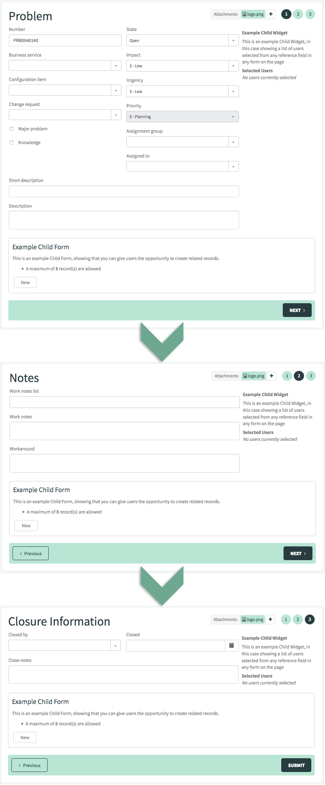
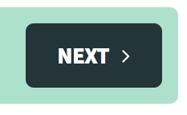
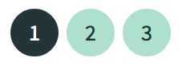
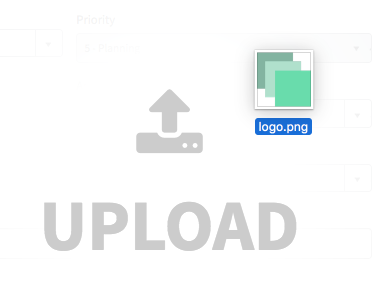
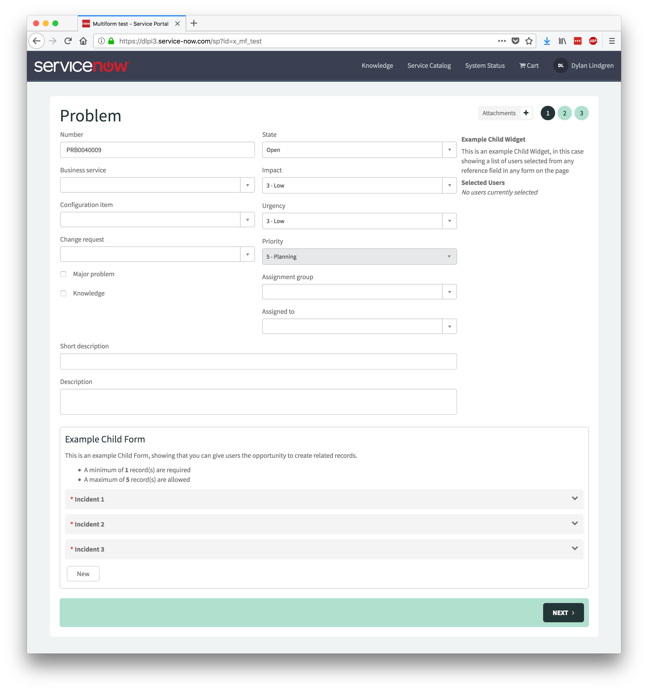
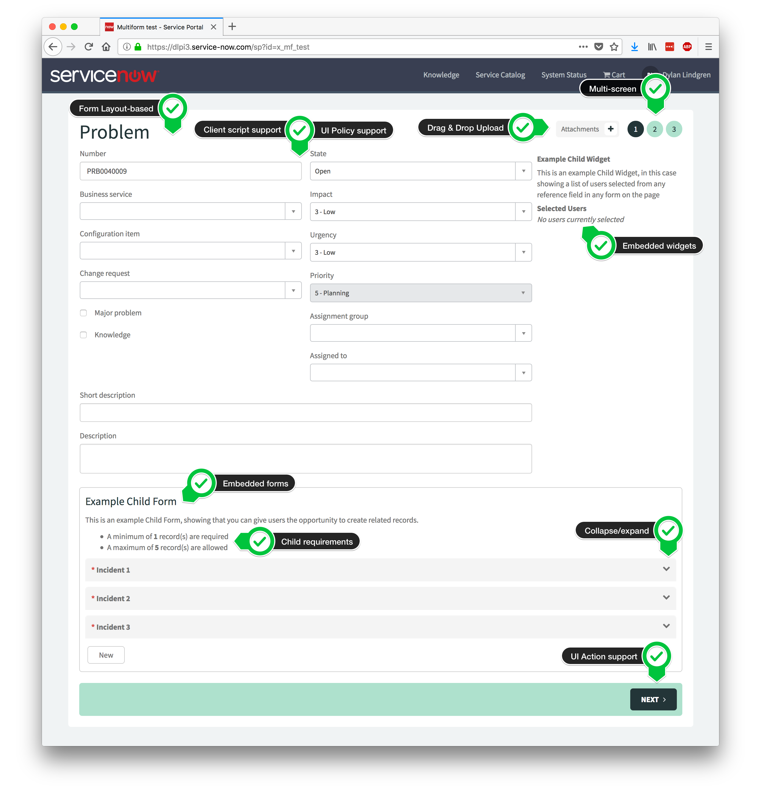

# Multiform

## Description

Multiform is an advanced Service Portal form widget that separates each section of the form onto sequential, numbered screens for improved user experience. It also offers a number of other benefits over the out-of-box form widget, such as:

- **Screen-based form completion**

	Each form section becomes its own screen:

  

	Screens are able to be navigated through the buttons at the bottom of the form:

  

	And using the indicators at the top-right:

  

- **Drag & drop file upload**

	Both drag and drop and regular upload (via the  button) are supported.

  

- **Support for all native form functionality**

	For example:

	- Client Scripts
	- UI Policies
	- Read-only fields
	- Mandatory fields
	- Form layouts
	- Reference fields
	- Dictionary attributes

- **Embedded “Child Forms” (related lists)**

	Child forms can be embedded on the top, left, right, or bottom, of a screen, or on all screens. Minimum and maximum numbers of related records can optionally be set.

- **Embedded “Child Widgets”**

	Child widgets can be embedded in the same places as child forms. An easy to use API can be called in your widgets to access fields on all forms and execute functions when the form changes.

- **Easy to style**

	Simply declare a few SASS variables in your theme/page/portal to override certain styles, such as indicator color, bottom bar color, and rounded corners.

## Screenshots





## Installation

1. Open Studio on your ServiceNow instance.
2. Click the **Import From Source Control** button.
3. As the value of the URL field use the following:
	`https://github.com/platform-experience/pi-multiform`
4. Press the **Import** button

## Configuration

The application includes a test page which can be accessed from the `/sp?id=x_mf_test` path on your instance. This will give you an example of some of the features and how one might configure them.

Whenever you drag the Multiform widget onto a page using Service Portal Designer, an instance of the widget is created. You can configure it by holdling CTRL and right-clicking on, selecting "Instance Options", and following the instructions displayed to open the instance in the platform view.

From the platform view, you have full control over the way your form is configured.

### Multiform Instance

The Multiform Instance record is the core record, which controls how the actual main form operates and displays.

| Field              | Description                                                                                                                                               | Mandatory | Default      |
|--------------------|-----------------------------------------------------------------------------------------------------------------------------------------------------------|-----------|--------------|
| Table              | The table that the form will show                                                                                                                         | yes       |              |
| Record             | Hard-code a record to display. If not defined, the sys_id URL parameter will be used. If this isn't supplied, a new record will be created.               | no        |              |
| View               | The view that the form will show. The form sections on this view will shown as "screens".                                                                 | yes       |              |
| Roles              | Roles that are required to be able to see this widget                                                                                                     | no        |              |
| Progression method | Whether users will be able to freely navigate using the indicators at any time, or only navigate to screens they have visited already.                    | yes       | Full control |
| Success page       | The Service Portal page that the user will be redirected to after form submission. The URL parameters `sys_id` and `table` will be supplied to this page. | yes       |              |
| Order              | Used to determine in what position this widget will display, relative to other widget instances in the same container.                                    | no        |              |
| CSS                | Additional CSS that will be loaded for this instance of the widget                                                                                        | no        |              |

### Multiform Child

There are two types of Multiform Children. Both extend from the Multiform Child table, and thus have some common options:

| Field        | Description                                                                   | Mandatory | Default     |
|--------------|-------------------------------------------------------------------------------|-----------|-------------|
| Parent       | The Multiform Instance that this is a child of                                | yes       |             |
| Active       | Control whether Multiform Child is used                                       | yes       | true        |
| Apply to     | Apply either to all screens, or a specific section                            | yes       | All screens |
| Form section | If Apply to is set to Specific section, you can choose the section from here  | yes       |             |
| Location     | Whether the child appears at the top, bottom, left, or right of the screen    | yes       | bottom      |
| Align self   | Flexbox property. See https://css-tricks.com/snippets/css/a-guide-to-flexbox/ | yes       | stretch     |
| Order        | Flexbox property. See https://css-tricks.com/snippets/css/a-guide-to-flexbox/ | yes       | 0           |
| Flex grow    | Flexbox property. See https://css-tricks.com/snippets/css/a-guide-to-flexbox/ | yes       | 0           |
| Flex shrink  | Flexbox property. See https://css-tricks.com/snippets/css/a-guide-to-flexbox/ | yes       | 1           |
| Flex basis   | Flexbox property. See https://css-tricks.com/snippets/css/a-guide-to-flexbox/ | yes       | auto        |

There are also some options unique to each type of child.

#### Child Form

| Field              | Description                                                                                                                                               | Mandatory | Default      |
|--------------------|-----------------------------------------------------------------------------------------------------------------------------------------------------------|-----------|--------------|
| Table              | The table that the form will show                                                                                                                         | yes       |              |
| Record             | Hard-code a record to display. If not defined, the sys_id URL parameter will be used. If this isn't supplied, a new record will be created.               | no        |              |
| View               | The view that the form will show. The form sections on this view will shown as "screens".                                                                 | yes       |              |
| Roles              | Roles that are required to be able to see this widget                                                                                                     | no        |              |
| Progression method | Whether users will be able to freely navigate using the indicators at any time, or only navigate to screens they have visited already.                    | yes       | Full control |
| Success page       | The Service Portal page that the user will be redirected to after form submission. The URL parameters `sys_id` and `table` will be supplied to this page. | yes       |              |
| Order              | Used to determine in what position this widget will display, relative to other widget instances in the same container.                                    | no        |              |
| CSS                | Additional CSS that will be loaded for this instance of the widget                                                                                        | no        |              |

#### Child Widget

| Field          | Description                                               | Mandatory | Default |
|----------------|-----------------------------------------------------------|-----------|---------|
| Widget         | The widget to be shown                                    | yes       |         |
| Widget options | Options that will be supplied to the widget when it loads | no        |         |

## CSS/SASS Variables

There are a number of SASS variables that can be declared in your portal's theme, CSS, or your page's CSS to override the default styling of the widget and make it fit in better with your portal.

| Variable | Description |
|---------------------------------|------------------------------------------------------------------------------------------------------------------------|
| `$pi-mf-header-color` | The text color used for headers |
| `$pi-mf-actions-bg` | The background color of the actions bar at the bottom of the form |
| `$pi-mf-actions-button` | The background color used for primary actions (e.g. Next), and border color used for secondary actions (e.g. Previous) |
| `$pi-mf-actions-button-color` | The text color used for primary actions |
| `$pi-mf-highlight-bg` | The background color of the attachment area |
| `$pi-mf-inner-form-bg` | The background color of inner forms |
| `$pi-mf-border-radius` | The border radius for the main form, action bar, action buttons, child form area, and child forms. |
| `$pi-mf-indicator-bg` | The background color of the indicators on the top-right of the screen |
| `$pi-mf-indicator-bg-active` | The background color of an active indicator (e.g. current screen) |
| `$pi-mf-indicator-color` | The text color of indicators |
| `$pi-mf-indicator-color-active` | The text color of active indicators |
| `$pi-mf-formgroup-border-color` | The border color of the child form area |
| `$pi-mf-attachment-pill-bg` | The background color of the individual attachment pills |
| `$pi-mf-attachment-pill-color` | The text color of the individual attachment pills |
| `$pi-mf-attachment-add-bg` | The background color of the "add attachment" button |
| `$pi-mf-attachment-add-color` | The color of the + icon in the "add attachment" button |

## Widget API

You can use the Multiform Widget API in your widgets to interact with Multiform, including the state of forms, values of fields, and screen navigation. The API is made available via the AngularJS service `PiMfManager`.

This API can be used for widgets embedded as a "Multiform Child Widget" or any other widget on the same page as a Multiform widget.

To use it, add `PiMultiForm` to the "Widget Dependencies" related list of the widget you're building.

Then, inject the `PiMfManager` dependency into your client script function as below:

```
function(PiMfManager) {
...
```

### Methods

#### `addOnScreenChangeFunc(callback)`

Add a function to be executed when the screen changes.

Returns: undefined

#### `addOnValueChangeFunc(callback)`

Add a function to be executed when a value in a form changes.

The function will be supplied with three arguments:

- Parameter 1: String - the field name that changed
- Parameter 2: String - the new value of the field that changed
- Parameter 3: Object - an object containing two properties
	-  `model`: the form model
	-  `gForm`: the GlideForm

Returns: undefined

#### `nextScreen()`

Move to the next screen

Returns: undefined

#### `prevScreen()`

Move to the previous screen

Returns: undefined

#### `goToScreen()`

Go to a specific screen

Returns: undefined

#### `getScreenCount()`

Get the number of screens

Returns: Integer

#### `isFirst()`

Check if we're on the first screen

Returns: boolean

#### `isLast()`

Check if we're on the last screen

Returns: boolean