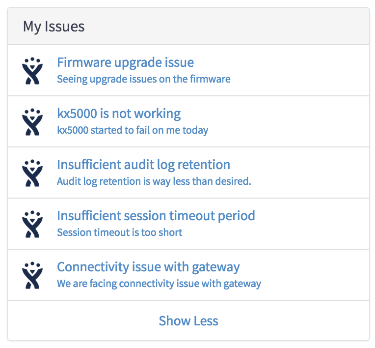
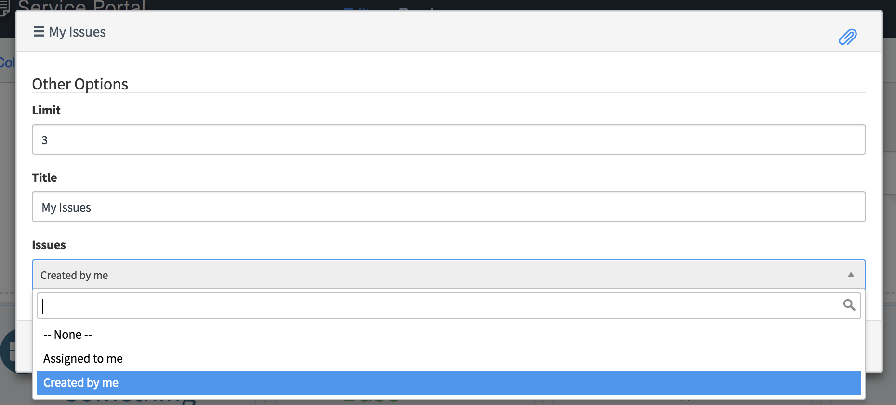
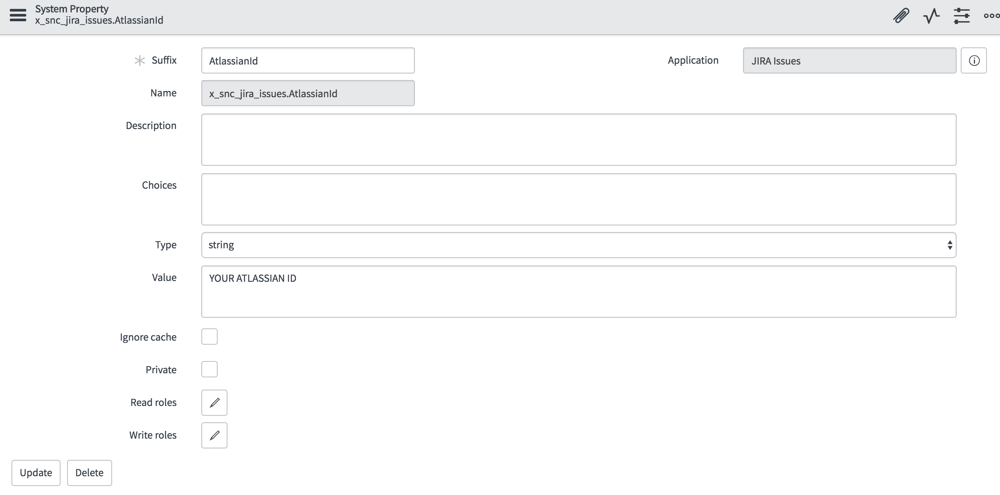
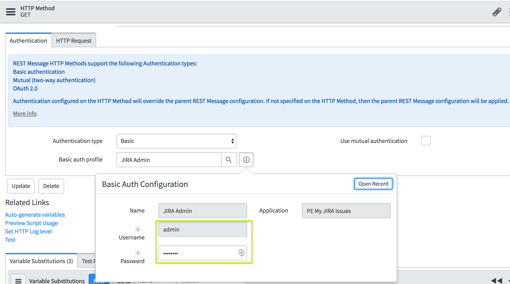

# My JIRA Issues

## Description

This is a simple JIRA integration, widget can be issued to list of issues assigned to you/created by you in JIRA.
## Screenshots

## Additional Information/Notes

The integration assumes you have attlasian account id. Example: https://[your-account-id].atlassian.net

---
## Installation
---
Download and install update set **[pe-my-jira-issues.u-update-set.xml](https://github.com/platform-experience/serviceportal-widget-library/blob/master/pe-foexp-401k/pe-foexp-401k-update-set.u-update-set.xml)**   
After installation, the widget can be accessed via the `Service Portal > Widgets` section for use and customization. 

---
## Configuration
---
Widget Option Schema parameters:
> Limit: Number of items you want to show on initial load of the widget. The remaining list can be loaded by clicking on Show more. Default is 5.
> 
> Title: Title for the widget.
> 
> Issues: Is a choice list, here you choose if you want to pull Issues assigned to you or created by you.
> 
> 

---
## Platform Dependencies
---
> None
---
## Sample Data and Data Structures
---
> None

---
## API Dependencies
---
System Property:
> AtlassianId : Put your atlassian account id here

Basic Auth:
> For the REST API to work, please put in your atlassian admin username/password for JIRA Admin basic auth profile.

---
## CSS/SASS Variables
---
> None