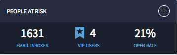
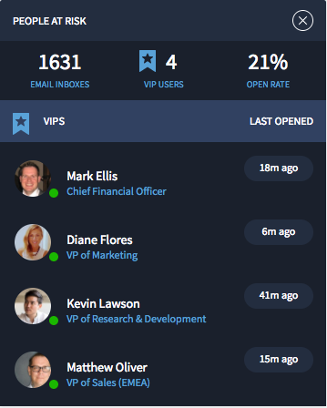

# People Card Flyout

## Description

This can be used to quickly craft a people card flyout widget with options.

## Screenshots
### Collapsed

### Expanded

## Additional Information/Notes
> None

---

## Installation

Download and install update set **[pe-people-card-flyout.u-update-set.xml](pe-people-card-flyout.u-update-set.xml)**   
After installation, the widget can be accessed via the `Service Portal > Widgets` section for use and customization. 
* SN Product Documentation - ['Load a customization from a single XML file'](https://docs.servicenow.com/search?q=Load+a+customization+from+a+single+XML+file)   (<i>Select appropriate instance version</i>)

---

## Configuration

Widget Option Schema parameters:

**"Title"** This is for changing the title in the panel header. 
**"Number 1"** This is for displaying the first integer in the panel body. 
**"Number 2"** This is for displaying the second integer in the panel body. 
**"Number 3"** This is for displaying the third integer in the panel body. 
**"Sub Text 1"** This is for displaying the first sub-text copy. 
**"Sub Text 2"** This is for displaying the second sub-text copy. 
**"Sub Text 3"** This is for displaying the third sub-text copy. 

---

## Platform Dependencies

### SN System Tables
* sys_user
* department

---

## Sample Data and Data Structures
> See 'Configuration' above

---

## API Dependencies

<i>Dependencies are included and configured as part of the provided Update Set.</i>
> None

---

## CSS/SASS Variables

_CSS/SASS variables are given default values that can be overridden with theming or portal-level CSS._

`$pe-theme-color: #283347 !default;` 
`$pe-theme-background-color: #1c2432 !default;` 
`$pe-text-color: #fff !default;` 
`$pe-sub-text-color: #68acd8 !default;` 
`$pe-status-color-normal: #29bd00 !default;` 