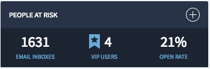

## Synopsis: People Card Flyout

This can be used to quickly craft a people card flyout widget with options.

## Installation

Installation is very simple, you can just download the update set "pe-people-card-flyout-set.xml" and install it on your instance. Then the widget is available for you to drag and drop on your page.

## Configuration

We provide options to configure the widget.

1. **"Title"** This is for changing the title in the panel header.

1. **"Number 1"** This is for displaying the first integer in the panel body.

1. **"Number 2"** This is for displaying the second integer in the panel body.

1. **"Number 3"** This is for displaying the third integer in the panel body.

1. **"Sub Text 1"** This is for displaying the first sub-text copy.

1. **"Sub Text 2"** This is for displaying the second sub-text copy.

1. **"Sub Text 3"** This is for displaying the third sub-text copy.

## Sass Variables

We provide five Sass variables to control the theme and colors.

`$pe-theme-color: #283347 !default;`

`$pe-theme-background-color: #1c2432 !default;`

`$pe-text-color: #fff !default;`

`$pe-sub-text-color: #68acd8 !default;`

`$pe-status-color-normal: #29bd00 !default;`