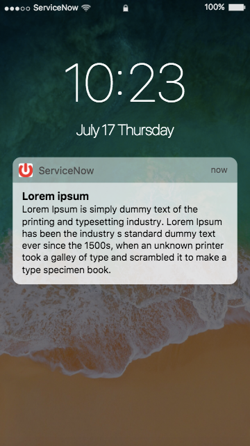

# Push Notification

## Description

This widget allows you to emulate for demo purposes a mobile (iOs based) push notification alert.
The most important feature is the availability of settings for easily and quickly configuring it.

**NOTE:** this widget only works on mobile.

## Screenshots
<kbd></kbd>

---
## Installation
---
Download and install update set **[pe-push-notification.u-update-set.xml](https://github.com/platform-experience/serviceportal-widget-library/blob/master/pe-push-notification/pe-push-notification.u-update-set.xml)**   
After installation, the widget can be accessed via the `Service Portal > Widgets` section for use and customization. 

* SN Product Documentation - ['Load a customization from a single XML file'](https://docs.servicenow.com/bundle/jakarta-application-development/page/build/system-update-sets/task/t_SaveAnUpdateSetAsAnXMLFile.html)

---
## Configuration
---
Widget Option Schema parameters:

- Time shown in the home page / locked screen, and if not specified the default is the current time
- Date shown in the home page / locked screen, and if not specified the default is the current date
- Notification Title
- Notification Time
- Body Title
- Body Text
- Background Image
- Landing Page

---
## Platform Dependencies
---
> None

---
## Sample Data and Data Structures
---
No sample data provided.

---
## API Dependencies
---
<i>Dependencies are included and configured as part of the provided Update Set.</i>

---
## CSS/SASS Variables
---
