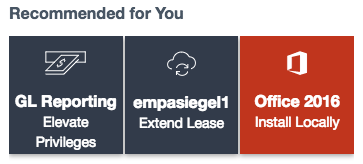

# Recommendation Cards

## Description

This can be used to quickly craft a set of recommendation cards.

## Screenshots

## Additional Information/Notes

Uses ServiceNow® [Service Catalog](https://docs.servicenow.com/bundle/istanbul-it-service-management/page/product/service-catalog-management/concept/c_ServiceCatalogManagement.html)

---

## Installation

Download and install update set **[pe-recommendation-cards.u-update-set.xml](https://github.com/platform-experience/serviceportal-widget-library/blob/master/pe-recommendation-cards/pe-recommendation-cards.u-update-set.xml)**   
After installation, the widget can be accessed via the `Service Portal > Widgets` section for use and customization. 
* SN Product Documentation - ['Load a customization from a single XML file'](https://docs.servicenow.com/bundle/jakarta-application-development/page/build/system-update-sets/task/t_SaveAnUpdateSetAsAnXMLFile.html)

---

## Configuration

### Widget Option Schema

| Option | Description | Default Value |
| :--- | :--- | :--- |
| `Title` | Widget Title. | Recommended for You |
| `Category` | Sets a category. | PE My Devices |
| `Fields` | Sets the field items to display for the catalog item, using a comma separated list. | sc_cat_item.name, sc_cat_item.icon, sc_cat_item.short_description |
| `Items` | Sets the catalog items for display. | GL Reporting, empasiegel1, Office 2016 |
| `Highlight` | Sets the highlighted items, which adds a background color to the item(s) using a comma separated list. | Office 2016 |
| `Show Title` | Shows the title if checked (true). | true |
| `Show All Catalog Items` | Displays all catalog items for a category, if checked (true). | false |

---

## Platform Dependencies

### SN System Tables
* sc_cat_item
* sc_cat_item_category
* sc_category

---

## Sample Data and Data Structures

> See 'Configuration' above

---

## API Dependencies

<i>Dependencies are included and configured as part of the provided Update Set.</i>
> None

---

## CSS/SASS Variables

_CSS/SASS variables are given default values that can be overridden with theming or portal-level CSS._
> None