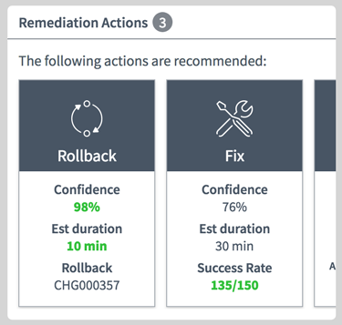

## Synopsis: Remediation Actions Widget



This widget displays choices for remediation actions.

## Installation

Installation is very simple, you can just download the update set "pe-remediation-actions.u-update-set.xml" and install it on your instance. Then the widget is available for you to drag and drop on your page.

## Configuration

Provide a sys_id of an anomaly alert to the **alert** option. The widget will not display if the alert is closed.

## Displayed Data

Options are defined in an array in client script.

```
c.actions = [
	{
		name: "Rollback",
		iconClasses: "fa fa-refresh",
		confidence: 98,
		duration: 10,
		change_request: 'CHG000123',
		href: 'https://www.example.com'
	},
	{
		name: "Fix",
		iconClasses: "fa fa-wrench",
		confidence: 76,
		duration: 30,
		change_request: 'CHG000123',
		href: 'https://www.example.com'
	},
	{
		name: "Failover",
		iconClasses: "fa fa-refresh",
		confidence: 35,
		duration: 90,
		change_request: 'CHG000123',
		href: 'https://www.example.com'
	}
];
```

## Sass Variables

The following Sass variables are given default values that can be overridden with theming or portal-level css.

```
$icon-circle-color: #7e848b !default;
$good-color: #3abe43 !default;
$bad-color: #ff402c !default;
```