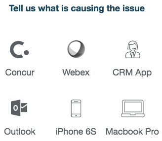

# Report Issue

## Description

This can be used to quickly craft a configurable widget with a list of items fed from a catalog.

## Screenshots

## Additional Information/Notes
Uses ServiceNow® [Service Catalog](https://docs.servicenow.com/bundle/istanbul-it-service-management/page/product/service-catalog-management/concept/c_ServiceCatalogManagement.html)

---

## Installation

Download and install update set **[pe-report-issue.u-update-set.xml](https://github.com/platform-experience/serviceportal-widget-library/blob/master/pe-report-issue/pe-report-issue.u-update-set.xml)**   
After installation, the widget can be accessed via the `Service Portal > Widgets` section for use and customization. 
* SN Product Documentation - ['Load a customization from a single XML file'](https://docs.servicenow.com/bundle/istanbul-application-development/page/build/system-update-sets/task/t_LoadCustomizationsFromAnXMLFile.html)

---

## Configuration

Widget Option Schema parameters:

**"Title"** Used to set the title option. `Default: Tell us what is causing the issue` 
**"Category"** This is for setting the category option `Default: PE Report Issue` 
**"Fields"** This is for defining the field item or items to display for the catalog item, using a comma separated list. For example: sc_cat_item.icon, sc_cat_item.name. `Default: sc_cat_item.name, sc_cat_item.icon` 
**"Items"** This is for defining catalog items for display. If the "Display all catalog items?" option is set to true, it will override this option. An example: Concur, Webex, CRM App. `Default: Concur, Webex, CRM App, Outlook, iPhone 6S, Macbook Pro` 
**"Display all catalog items?"** This option will return all catalog items for a category, if checked (true). If unchecked (false), will only return the defined option Items. `Default: false` 

---

## Platform Dependencies

### SN System Tables
* sc_cat_item
* sc_cat_item_category
* sc_category

---

## Sample Data and Data Structures

> See 'Configuration' above

---

## API Dependencies

<i>Dependencies are included and configured as part of the provided Update Set.</i>
> None

---

## CSS/SASS Variables

_CSS/SASS variables are given default values that can be overridden with theming or portal-level CSS._
> None