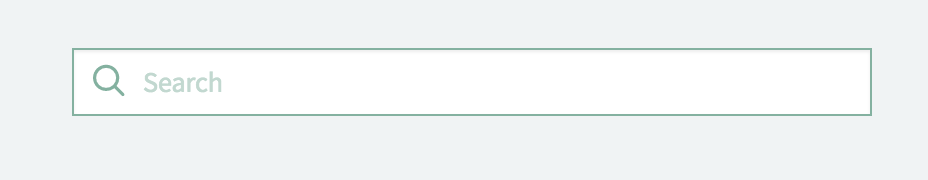

# Typeahead Search

## Description

The Typeahead Search widget provides suggestions for users as they type in the search field. Main features are:
<br/>
> Providing suggestions through the autocomplete search library **[Twitter Typeahead v1.2.0](https://github.com/corejavascript/typeahead.js)**
<br/>
> Obtain data through REST. It can connect to Table APIs defined in the current or different instance. If a different instance is used, it is necessary defining the options about REST in the Data section and a **[CORS rule](https://docs.servicenow.com/bundle/london-application-development/page/integrate/inbound-rest/concept/c_CORSSupport.html)** in the target instance.
<br/>
> Broadcasing on record selection (event name: "pe-typeahead-selection"). Sample code to receive the selected record (json object):
<br/>
```javascript
$rootScope.$on('pe-typeahead-selection', function(event, obj){});
```

## Screenshots



## Additional Information/Notes
> None
---
## Installation
---
Download and install update set **[pe-rest-typeahead-search.u-update-set.xml](https://github.com/platform-experience/serviceportal-widget-library/blob/master/pe-rest-typeahead-search/pe-rest-typeahead-search.u-update-set.xml)** <br/><br/>
After installation, the widget can be accessed via the `Service Portal > Widgets` section for use and customization.<br/>
* SN Product Documentation - ['Update set use'](https://docs.servicenow.com/bundle/london-application-development/page/build/system-update-sets/concept/update-set-procedures.html)

---
## Configuration
---
Widget Option Schema parameters:
<br/><br/>
Presentation:
<br/>
> Bootstrap Color: select Default to use custom SASS variables in the Theme (complete list at the top of the widget CSS section).
> Bootstrap Size: this will define the padding around the Search text field (md, lg, etc.).
> Placeholder: the text hint in the empty input field.
> Overlay Effect: if enabled, it will apply a CSS effect (class pe-rest-typeahead-search__dim) to help the user in focusing more on the results.
<br/>
Data:
<br/>
> Table: table containing the records to query.
> Filter: additional filter. _Optional._
> Display Field: the column/attribute to show in the result list.
> Query Field: the column/attribute used by Twitter Typeahead to provide the suggestions.
> Order By: the result sorting. _Optional._
> Order Direction: the result sorting direction. _Optional._
> Limit Result: the maximum number of records to obtain and display.
> REST Instance: if the REST Table API is in a different instance. _Optional._
> REST Username: if REST Instance is used, provide the credentials. _Optional._
> REST Password: if REST Instance is used, provide the credentials. _Optional._

---
## Platform Dependencies
---

---
## Sample Data and Data Structures
---
Sample data is in the default options.

---
## API Dependencies
---
<i>Dependencies are included and configured as part of the provided Update Set.</i>
> typeahead.js v1.2.0
---
## CSS/SASS Variables
---
_CSS/SASS variables are given default values that can be overridden with theming or portal-level CSS._
> $pe-rest-typeahead-hover-color
> $pe-rest-typeahead-hover-bg
> $pe-rest-typeahead-menu-bg
> $pe-rest-typeahead-border-color
> $pe-rest-typeahead-border-radius
> $pe-rest-typeahead-border
> $pe-rest-typeahead-max-width
> $pe-rest-typeahead-dim-opacity
