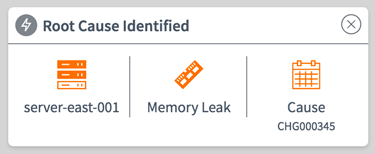
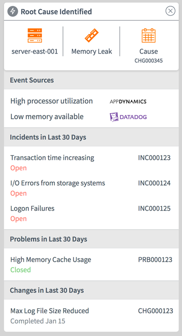
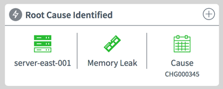

# Root Cause and Root Cause Details

## Description

Query the most recent anonaly alert from the *em_alert_anomaly* table and provide associated record details: Configuration Item, Problem, and Change that has been identified as having caused the Incident. From the Problem record, any other Incidents are listed in 'Related Incidents'.

The detailed data is shown when the plus (+) graphic in the top right is selected/clicked, further details about the Root Cause is displayed through use of the `pe-root-cause-details` widget (_included_).

## Screenshots
### Collapsed View

### Expanded View

### Resolved View

## Additional Information/Notes
The update set installs two (2) widgets - PE Root Cause and PE Root Cause Details.
Though the PE Root Cause widget uses the PE Root Cause Details widget to display additional information about the alert anomaly, the details widget does not rely on the first widget in order to function.  The PE Root Cause Details can be used separately when configured with an anomaly alert record's sys_id.

---
## Installation
---
Ensure the that the **Performance Analytics - Content Pack - Event Management** plugin is Activated per the SN Plugin support section below.  
Download and install update set **[pe-root-cause.u-update-set.xml](https://github.com/platform-experience/serviceportal-widget-library/blob/master/pe-root-cause/pe-root-cause.u-update-set.xml)**   
After installation, the widget can be accessed via the `Service Portal > Widgets` section for use and customization. 
* SN Product Documentation - ['Load a customization from a single XML file'](https://docs.servicenow.com/bundle/jakarta-application-development/page/build/system-update-sets/task/t_SaveAnUpdateSetAsAnXMLFile.html)

---
## Configuration
---
Widget Option Schema parameters:

1. **alert_sysid**: Provide an anomaly alert's sys_id and data in the widget will display based on related records.

1. **titleIconClasses**: Provide a set of Font Awesome css classes for an icon to display next to the title. Defaults to `'fa fa-bolt'`.

---
## Platform Dependencies
---
### SN Plugin Support

Widget support is provided by the ServiceNow® [Performance Analytics - Content Pack - Event Management](https://docs.servicenow.com/bundle/istanbul-performance-analytics-and-reporting/page/use/performance-analytics/reference/r_PALandingPage.html) 
Performance Analytics content pack for Event Management core out-of-the-box KPIs.  
**For Customers:** _Activation of this plugin on production instances may require a separate Performance Analytics license. Contact ServiceNow for details._

### SN System Tables
* em_alert_anomaly
* em_event_type
* task

---
## Sample Data and Data Structures
---
With the Performance Analytics - Content Pack - Event Management installed. The System table *em_alert_anomoly* and *em_event_type* is created.  `This update set will install samples record into the table.`

`NOTE`
There are five (5) record insert or updates that occur as part of the Update Set installation.
The record for the *em_alert_anomaly* is updated to create the necessary links/connections with the required Change record, Problem record, and Incident record that are part of the _Task_ table.  These records are also provided as part of the update set.  Additionally, there is a single record created for the Event Type.  The record is added to the *em_event_type* table.

---
## API Dependencies
---
<i>Dependencies are included and configured as part of the provided Update Set.</i>

None

---
## CSS/SASS Variables
---
_CSS/SASS variables are given default values that can be overridden with theming or portal-level CSS._

PE Root Cause widget: 
`$icon-circle-color: #7e848b !default;` 
`$text-color: #485563 !default;` 
`$divider-color: #7E848B !default;` 
`$status-alert-color: #ff6f00 !default;` 
`$status-recovered-color: #34ba3d !default;` 

 PE Root Cause Details widget: 
`$list-header-bg-color: #e8e8e8 !default;` 
`$state-default-color: #557f90 !default;` 
`$state-positive: #3abe43 !default;` 
`$state-negative: #ff402c !default;` 