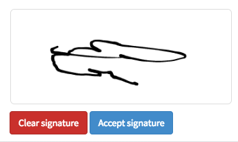

## Synopsis: Scratch Pad Widget

This widget can be used to create a simple signature pad/scratch pad.

## Installation

Installation is very simple, you can just download the update set **pe-scratch-pad.u-update-set.xml** and install it on your instance. Then the widget is available for you to drag and drop on your page.
