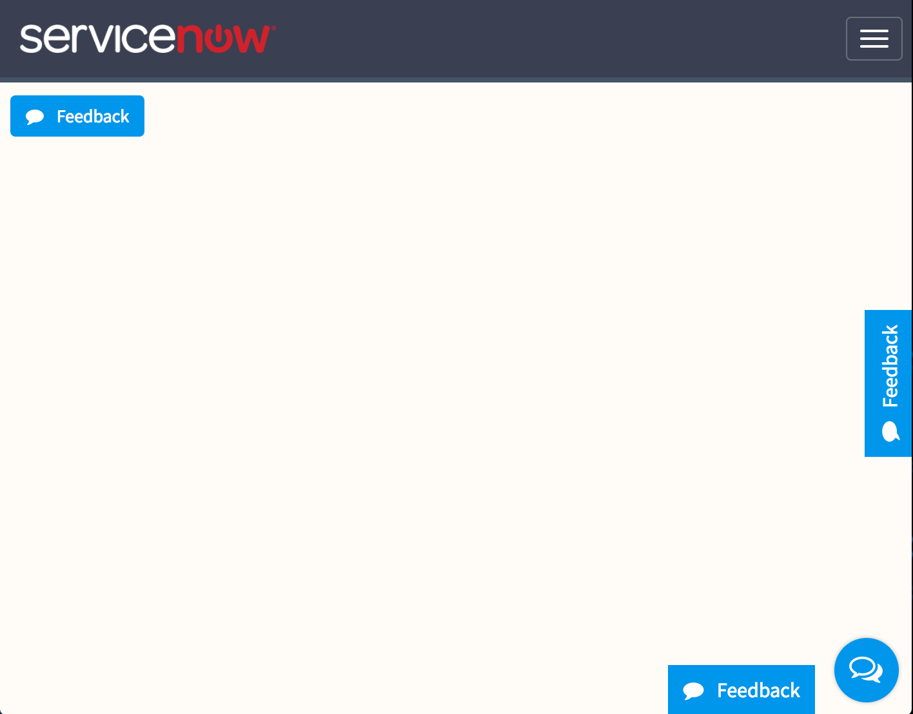
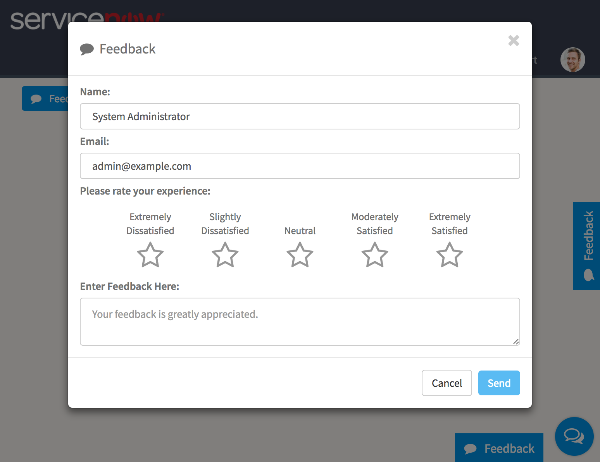

# Simple Feedback

## Description

Widget provides a simple feedback collection capability that can be added to a site.  The feedback input shows as a modal and can be configurable in how it functions.

## Screenshots
### Button Style Choices

### Modal

## Additional Information/Notes
Update set installs the data table 'Simple Feedback' (u_simple_feedback)

---
## Installation
Download and install update set **[pe-simplefeedback.u-update-set.xml](https://github.com/platform-experience/serviceportal-widget-library/blob/master/pe-simplefeedback/pe-simplefeedback.u-update-set.xml)**   
After installation, the widget can be accessed via the `Service Portal > Widgets` section for use and customization. 
* SN Product Documentation - ['Load a customization from a single XML file'](https://docs.servicenow.com/bundle/istanbul-application-development/page/build/system-update-sets/task/t_LoadCustomizationsFromAnXMLFile.html)

---
## Configuration
Widget Option Schema parameters:

**dataTable** - Data Table Name `Default: u_simple_feedback` 
**autoHideTY** - Auto Hide Feedback Thank You `Default: true` 
**autoHideDuration** - Auto Hide Duration (in seconds) `Default: 3.5` 
**showFormButton** - Show Form Button `Default: true` - set to false if providing different button or opening method 
**hdrTitle** - Header Title `Default: Feedback` 
**hdrIcon** - Header Icon `Default: fa-comment` 
**txtTYMsg** - Thank You Message `Default: Thank you for your feedback.` 
**showWho** - Show Who `Default: true`
**showRating** - Show Rating `Default: true` 
**txtRating** - Rating Text `Default: Please rate your experience:` 
**lvlRating** - Levels of Rating `Default: 5` 
**lvlRatingTxt** - Levels of Rating Choices `Defaults: see below` 
 * Extremely Dissatisfied
 * Slightly Dissatisfied
 * Neutral
 * Moderately Satisfied
 * Extremely Satisfied

> Note: **hdrIcon** - Can be replaced with any supported glyph/icon using the [fontawesome.io](http://fontawesome.io/cheatsheet/) classes.

---
## Platform Dependencies
> None

---
## Sample Data and Data Structures

`Table is created with update set - u_simple_feedback`

---
## API Dependencies
<i>Dependencies are included and configured as part of the provided Update Set.</i>
> None

---
## CSS/SASS Variables
_CSS/SASS variables are given default values that can be overridden with theming or portal-level CSS._

`$btn-primary-background: #0096EC !default;` 
`$btn-hover-background: #2783FC !default;` 
