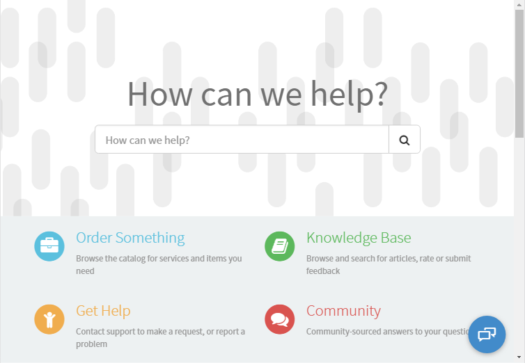
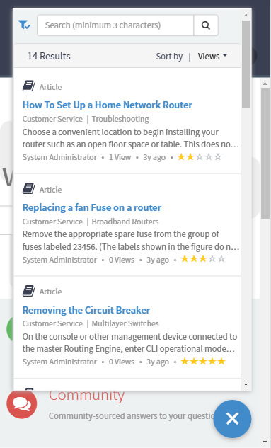
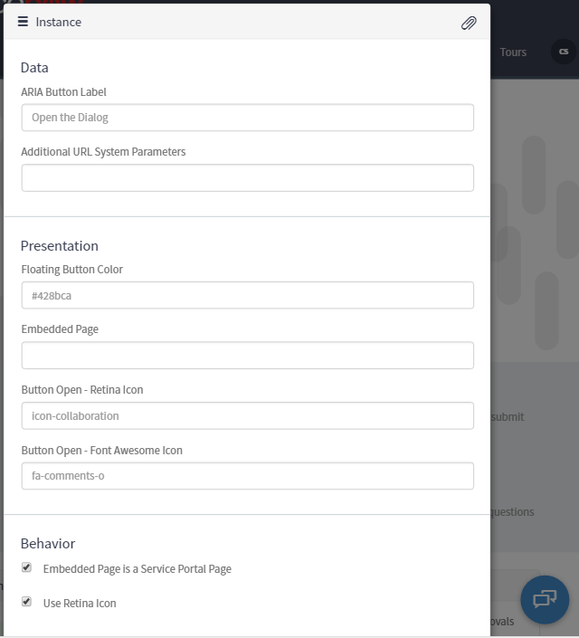

# Service Portal Floating Viewport

## Description

The widget is a refactoring of the Service Portal Virtual Agent widget's outer wrapper.  In this version, the content to show  ($.do or Service Portal page) in the viewport is configurable using the widget's option schema.  Additional configurations include, button color, button icon-ography (Retina Icons or Font Awesome), and additional URL System Parameters.

## Screenshots
### Floating Button

### Viewport Open

### Instance Options

## Additional Information/Notes
Update set creates the necessary dependency for accessing the Retina Icons.   
The list of Retina icons can be found here - https://hi.service-now.com/styles/retina_icons/retina_icons.html 
The list of Font Awesome (v 4.7.0) icons can be found here - https://fontawesome.com/v4.7.0/ 

---
## Installation
Download and install update set **[pe-sp-floating-viewport.u-update-set.xml](https://github.com/platform-experience/serviceportal-widget-library/blob/master/pe-sp-floating-viewport/pe-sp-floating-viewport.u-update-set.xml)**   
After installation, the widget can be accessed via the `Service Portal > Widgets` section for use and customization. 
* SN Product Documentation - ['Load a customization from a single XML file'](https://docs.servicenow.com/bundle/kingston-application-development/page/build/system-update-sets/task/t_SaveAnUpdateSetAsAnXMLFile.html)

---
## Configuration
Widget Option Schema parameters:

### Data
**aria_button_label** - Text used to describe the button for on screen readers `Default: Open the dialog ` 
**va_url_params** - System Parameters (sysparm_###) or other URL parameters that are required for the page being rendered in the viewport 
### Presentation
**button_color** - HEX Value for giving the button a different color `Default: #428bca` 
**embedded_page** - Page reference for showing in the viewport 
**retina_icon** - Retina Icon name to show on the button when the viewport is in the closed state.`Default: icon-collaboration` 
**fa_icon** - Font Awesome Icon name to show on the button when the viewport is in the closed state. `Default: fa-comments-o ` 
### Behavior
**is_sp_page** - If the embedded page is a Service Portal page this must be checked.  For any other type of pages uncheck. `Default: Checked` 
**use_retina_icon** - Check to use the prescribed Retina Icon. Uncheck to use the prescribed Font Awesome icon. `Default: Checked`  

---
## Platform Dependencies

The retina_icons.css file is required and provided as a core file of the instance.

---
## API Dependencies
<i>Dependencies are included and configured as part of the provided Update Set.</i>
> None

---
## CSS/SASS Variables
> None
