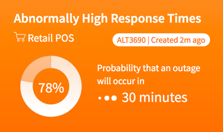
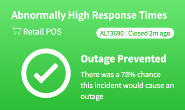

## Status Alert

## Description

Displays status information about the most recent alert record from the *em_alert_anomaly* table.

## Screenshots
### Alert/Warning View

### Resolved View

---
## Installation
---
Ensure the that the **Performance Analytics - Content Pack - Event Management** plugin is Activated per the SN Plugin support section below.  
Download and install update set **[pe-status-alert.u-update-set.xml](pe-status-alert.u-update-set.xml)**   
After installation, the widget can be accessed via the `Service Portal > Widgets` section for use and customization. 
* SN Product Documentation - ['Load a customization from a single XML file'](https://docs.servicenow.com/search?q=Load+a+customization+from+a+single+XML+file)   (<i>Select appropriate instance version</i>)

---
## Configuration
---
Widget Option Schema parameters:

**alert_sysid**: Provide a specific *em_alert_anomaly* record sys_id to display. `Default: Most recent record in the em_alert_anomaly table.` 

**probability**: Number of percent of chance an outage will occur by a certain time. `Default: 67` 

**outage_eta**: Provide a time string (in minutes) for when an outage is expected to occur. `Default: 30` 

---
## Platform Dependencies
---
### SN Plugin Support

Widget support is provided by the ServiceNow® [Performance Analytics - Content Pack - Event Management](https://docs.servicenow.com/bundle/istanbul-performance-analytics-and-reporting/page/use/performance-analytics/reference/r_PALandingPage.html) 
Performance Analytics content pack for Event Management core out-of-the-box KPIs.  
**For Customers:** _Activation of this plugin on production instances may require a separate Performance Analytics license. Contact ServiceNow for details._

### SN System Tables
* em_alert_anomaly

---
## Sample Data and Data Structures
---
With the Performance Analytics - Content Pack - Event Management installed the System table *em_alert_anomoly* is created.  `This update set will install a sample record into the table.`

---
## API Dependencies
---
<i>Dependencies are included and configured as part of the provided Update Set.</i>

* HighCharts API (v 5.0.5 - Recommended)  w/Export and No Data plug-ins
   Latest version(s) available from [HighCharts.com](http://http://www.highcharts.com/products/highcharts/)
   Additional HighCharts Utility - [highcharts-ng](https://github.com/pablojim/highcharts-ng) - Angular Directive for HighCharts (__not used or distributed__)

---
## CSS/SASS Variables
---
_CSS/SASS variables are given default values that can be overridden with theming or portal-level CSS._

`$text-color: #485563 !default;` 
`$status-alert-color: #ff6f00 !default;` 
`$status-alert-gradient: linear-gradient(#fe8a30, #ff6f00) !default;` 
`$status-recovered-color: #34ba3d !default` 
`$status-recovered-gradient: linear-gradient(#6ce474, #34ba3d) !default;` 

Testing more indeed