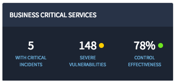
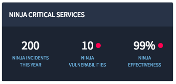

## Synopsis: Status Card Widget

This widget can be used to quickly craft a status card with configurable options.

## Installation

Installation is very simple, you can just download the update set "pe-status-card.u-update-set.xml" and install it on your instance. Then the widget is available for you to drag and drop on your page.

## Configuration

We provide some options to configure the widget.

1. **"Title"** This is for changing the title in the panel header.

1. **"Status Number 1"** This is for displaying the first status integer in the panel body.

1. **"Status Number 2"** This is for displaying the second status integer in the panel body.

1. **"Status Number 3"** This is for displaying the third status integer in the panel body.

1. **"Sub Text 1"** This is for displaying the first sub-text copy.

1. **"Sub Text 2"** This is for displaying the second sub-text copy.

1. **"Sub Text 3"** This is for displaying the third sub-text copy.

1. **"Status Indicator 2"** Provides you a choice of status indicators, which you can select.

1. **"Status Indicator 3"** Provides you a choice of status indicators, which you can select.

### Status Indicator Choices
* danger
* normal
* warning

## Sass Variables

We provide four Sass variables to control the status indicator color and anchor text.

`$pe-status-color-danger: #ff0050 !default;`

`$pe-status-color-normal: #6ee520 !default;`

`$pe-status-color-warning: #ffce00 !default;`

`$pe-anchor-color: #68acd8 !default;`