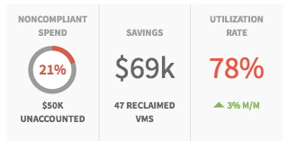

## Synopsis: Summary Data Snippet



This widget can be used to quickly obtain a card containing sub sections with data and a sample charts.

## Installation

Installation is very simple, you can just download the update set **pe-summary-data-snippet-update-set.xml** and install it on your instance. Then the widget is available for you to drag and drop on your page.

**Important note: This widget makes use of [pe-donut-chart-wizard](https://github.com/platform-experience/serviceportal-widget-library/tree/master/Charts/pe-donut-chart-wizard) to display user avatar, name and title, this widget is already part of the update set.

People Info widget is injected dynamically in client controller.

```javascript

  c.data.chart = {
    primary_color: '#e74c3c',
    background_color: '#9b9b9b',
    chart_width: '60',
    font_size: '18px',
    font_weight: '600'
  };

  c.data.chart_data = {
    label: '21%',
    current: 1,
    total: 5
  };

spUtil.get('pe-donut-chart-wizard', {
    primary_color: c.data.chart.primary_color,
    background_color: c.data.chart.background_color,
    chart_width: c.data.chart.chart_width,
    font_size: c.data.chart.font_size,
    font_weight: c.data.chart.font_weight,
    chart_data: c.data.chart_data
  }).then(function (response) {
    c.data.embedded_widget = response;
  });
```
