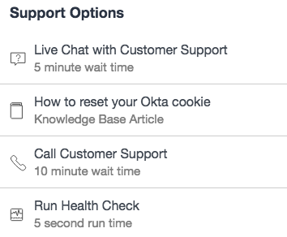

## Synopsis: Support Options Widget

This can be used to quickly craft a configurable widget with a list items fed from a catalog.

## Installation

Installation is very simple, you can just download the update set "pe-support-options.u-update-set.xml" and install it on your instance. Then the widget is available for you to drag and drop on your page.

## Configuration

We provide 3 options to configure the widget.

1. **"Title"** This is for changing the title. The title, Support Options, will be the default if no option is defined.

1. **"Category"** This is for defining a category; PE Support Options will be the default if no option is defined.

1. **"Items"** This is for defining the item or items to display from the category. Please add multiple items in a comma separated list. For example: sc_cat_item.icon, sc_cat_item.name, etc. The following items are chosen by default if no options are defined: sc_cat_item.name, sc_cat_item.icon, sc_cat_item.short_description.