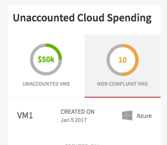

## Synopsis: Tab Chart Selector




This widget can be used to create a simple tabs layout with the selection on a Chart.

***

## Installation

Installation is very simple, you can just download the update set **pe-tab-chart-selector-update-set.xml** and install it on your instance. Then the widget is available for you to drag and drop on your page.

We provide a single option to make easy to build the stacked bar graph:

**"Graph Data"**, the value is a sample JSON object that you can copy from here:

```javascript
    [
      {
          "width":"60%",
          "color":"rgb(19, 35, 71)",
          "info_text":"AWS",
          "info_number":""
      },
      {
          "width":"20%",
          "color":"rgb(28, 91, 125)",
          "info_text":"AZURE",
          "info_number":""
      },
      {
          "width":"20%",
          "color":"rgb(150, 198, 200)",
          "info_text":"VMW",
          "info_number":""
      }
    ]
```

***

We provide four SASS variables to control the chat and call icon colors.

`$pe-brand-primary:#337ab7 !default;`

You can override these variables at portal level using the **themes**.


