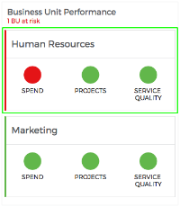

# PE Tabbed Panel Horizontal

## Description

The widget provides the ability to have three (3) horizontally aligned tabs.
When a tab/indicator is clicked a container displays below the widget with additional information as part of the widget or another widget element/component.

## Screenshots

## Additional Information/Notes
> None
---
## Installation
---
Download and install update set **[pe-tabbed-panel-horizontal.u-update-set.xml](https://github.com/platform-experience/serviceportal-widget-library/blob/master/pe-tabbed-panel-horizontal/pe-tabbed-panel-horizontal.u-update-set.xml)**   
After installation, the widget can be accessed via the `Service Portal > Widgets` section for use and customization. 
* SN Product Documentation - ['Load a customization from a single XML file'](https://docs.servicenow.com/bundle/istanbul-application-development/page/build/system-update-sets/task/t_LoadCustomizationsFromAnXMLFile.html)

---
## Configuration
---
Widget Option Schema parameters:
> None
---
## Platform Dependencies
---
> None
---
## Sample Data and Data Structures
---
Sample data is annotated and included as part of the widget's Server Script file.

---
## API Dependencies
---
<i>Dependencies are included and configured as part of the provided Update Set.</i>
> None
---
## CSS/SASS Variables
---
_CSS/SASS variables are given default values that can be overridden with theming or portal-level CSS._

`$tph-font-color: #2e2e2e !default;` 
`$tph-gray-color: #65666A !default;` 
`$tph-red-color: #e51b24 !default;` 
`$tph-orange-color: #e89033 !default;` 
`$tph-green-color: #70be5a !default;` 
`$tph-background-color: #ffffff !default;` 
`$tph-border-color: #e4e5e6 !default;` 
`$tph-niblet-color: #e51b24 !default;` 