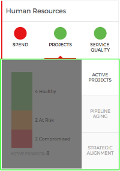
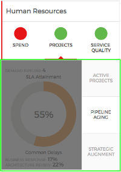
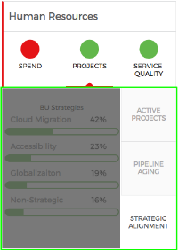

# Synopsis: PE Tabbed Panel Vertical 

The widget provides the ability to have three (3) vertically aligned tabs to the right of the widget space.

When a tab is clicked, a container is displayed, to the left of the tabs; with additional information as part of the widget or another widget element/component.

***

## Installation

Download and installation of update set **[pe-tabbed-panel-vertical.u-update-set.xml]()** includes this widget.
 After installation, the widget can be accessed via the Service Portal > Widgets section for use and customization.
* SN Product Documentation - ['Load a customization from a single XML file'](https://docs.servicenow.com/search?q=Load+a+customization+from+a+single+XML+file)   (<i>Select appropriate instance version</i>)

## Sample Data

Sample data is annotated and included as part of the widget's Client Script file.

## CSS/SASS Variables

Following SASS variables are used to control colors of text, borders, status indicators, etc. 
`$tpv-font-color: #2e2e2e !default;` 
`$tpv-darkgray: #65666A !default;` 
`$tpv-lightgray: #dcdcdc !default;` 
`$tpv-superlightgray: #f1f1f1 !default;` 
`$tpv-red: #e51b24 !default;` 
`$tpv-orange: #e89033 !default;` 
`$tpv-green: #70be5a !default;` 
`$tpv-background-color: #ffffff !default;` 
`$tpv-border-color: #dcdcdc !default;` 

## API Dependencies
<i>Not Applicable</i>

## Similar Widgets
<i>Not Applicable</i>