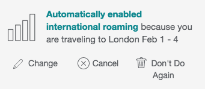

# Travel Card

## Description

This can be used to quickly craft a travel card widget.

## Screenshots

## Additional Information/Notes
> None
---
## Installation
---
Download and install update set **[pe-travel-card.u-update-set.xml](https://github.com/platform-experience/serviceportal-widget-library/blob/master/pe-travel-card/pe-travel-card.u-update-set.xml)**   
After installation, the widget can be accessed via the `Service Portal > Widgets` section for use and customization. 
* SN Product Documentation - ['Load a customization from a single XML file'](https://docs.servicenow.com/bundle/istanbul-application-development/page/build/system-update-sets/task/t_LoadCustomizationsFromAnXMLFile.html)

---
## Configuration
---
Widget Option Schema parameters:
> None
---
## Platform Dependencies
---
> None
---
## Sample Data and Data Structures
---
Sample data hard coded in the HTML template.

---
## API Dependencies
---
<i>Dependencies are included and configured as part of the provided Update Set.</i>
> None
---
## CSS/SASS Variables
---
_CSS/SASS variables are given default values that can be overridden with theming or portal-level CSS._
> None

Testing!