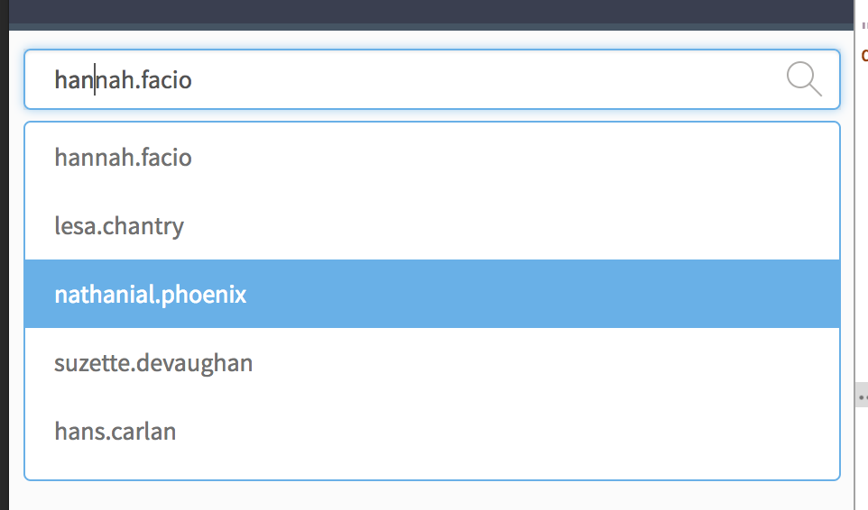
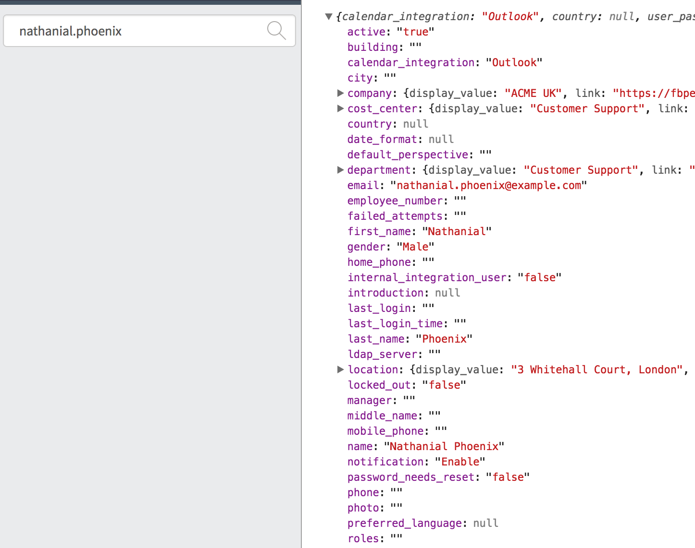

# Travel Card

## Description

This widget is providing a Search field where it is possible to use the typeahead functionaloty with a lookup through RESTFul.

## Screenshots

## Additional Information/Notes
> None
---
## Installation
---
Download and install update set **[pe-travel-card.u-update-set.xml](https://github.com/platform-experience/serviceportal-widget-library/blob/master/pe-typeahead-search/pe-typeahead-search.u-update-set.xml)**   
After installation, the widget can be accessed via the `Service Portal > Widgets` section for use and customization. 
* SN Product Documentation - ['Load a customization from a single XML file'](https://docs.servicenow.com/bundle/istanbul-application-development/page/build/system-update-sets/task/t_LoadCustomizationsFromAnXMLFile.html)

---
## Configuration
---
Widget Option Schema parameters:
> Table name
> Columns/Fields to retrieve in the RESTFul response (optional)
> Column to use for lookup condition
> Column with the value to display in the UI with the result

---
## Platform Dependencies
---
> None
---
## Sample Data and Data Structures
---
Sample data is in the default options.

---
## API Dependencies
---
<i>Dependencies are included and configured as part of the provided Update Set.</i>
> typeahead.js
---
## CSS/SASS Variables
---
_CSS/SASS variables are given default values that can be overridden with theming or portal-level CSS._
> None
