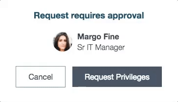

## User Request

## Description

This can be used to quickly craft a user request widget.

## Screenshots

## Additional Information/Notes 

This widget makes use of [pe-people-info widget](https://github.com/platform-experience/serviceportal-widget-library/tree/master/people-card/pe-people-info) to display the user avatar, name and title.
> Widget is included with the update set.

People Info widget is injected dynamically in the client controller.

---
## Installation
---
Download and install update set **[pe-user-request.u-update-set.xml](pe-user-request.u-update-set.xml)**   
After installation, the widget can be accessed via the `Service Portal > Widgets` section for use and customization. 
* SN Product Documentation - ['Load a customization from a single XML file'](https://docs.servicenow.com/search?q=Load+a+customization+from+a+single+XML+file)   (<i>Select appropriate instance version</i>)
---
## Configuration
---
Widget Option Schema parameters:

**"Header"** Card Header.  `Default: Request Requires Approval` 
**"Show Only Picture"** This is for enabling the ability to toggle the picture display. This will override and thus hide the job title, if enabled. 
**"Show Job Title"** This is for enabling the ability to toggle the job title display. 
**"Show Call & Chat"** This is for enabling the ability to toggle the call & chat display. 

---
## Platform Dependencies
---
> None
---
## Sample Data and Data Structures
---
> See 'Configuration' above
---
## API Dependencies
---
<i>Dependencies are included and configured as part of the provided Update Set.</i>
> None
---
## CSS/SASS Variables
---
_CSS/SASS variables are given default values that can be overridden with theming or portal-level CSS._
> None