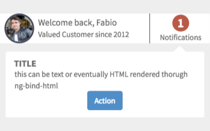

## Welcome User

## Description

This widget can be used to create a simple people card with name and profile picture when the user login, and provide notifications basing on custom events.

## Screenshots

## Additional Information/Notes
> None
---
## Installation
Download and install update set **[pe-technician-card.u-update-set.xml](pe-technician-card.u-update-set.xml)**   
After installation, the widget can be accessed via the `Service Portal > Widgets` section for use and customization. 
* SN Product Documentation - ['Load a customization from a single XML file'](https://docs.servicenow.com/search?q=Load+a+customization+from+a+single+XML+file)   (<i>Select appropriate instance version</i>)
---
## Configuration
Language variants can be created through the section System UI -> UI Messages, and displayed in the HTML body with the syntax: 
* ${<i>key value specified in the Message record</i>}.
---
## Platform Dependencies
> None
---
## Sample Data and Data Structures
> See 'Configuration' above
---
## API Dependencies
<i>Dependencies are included and configured as part of the provided Update Set.</i>
> None
---
## CSS/SASS Variables
The widget is using colors from Bootstrap SASS variables, and a minimal style configuration to make it easy to customize.
_CSS/SASS variables are given default values that can be overridden with theming or portal-level CSS._
