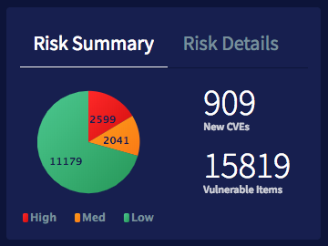

# Security: Risk Summary

## Description

Get snapshot of risks from your personalized security dashboard with this Security Operations widget.

## Screenshot

## Additional Information/Notes

> None

## Configuration

### Widget Option Schema

| Option | Description | Default Value |
| :--- | :--- | :--- |
| `Update Interval` | Chart refresh interval. |  |
| `Table` | Table from which to aggregate the data. Overrides the Script Include parameter. |  |
| `Field` | Table fields used for the aggregation of data. |  |
| `Encoded Query` | The encoded query limit the data returned. All data returned if empty. |  |
| `Script Include` | Used to get specific calculated data or more advanced data sets. By default this value is "PEHighchartsExample" for demo purposes. Overridden if the 'Table' parameter is used. |  |
| `Function` | Function defined in the Script Include. Default: "getDemoData" for demo purposes. |  |
| `Parameter1` | A parameter passed/sent to the Script Include and Function combination. |  |
| `Enable Export` | An option to enable export. |  |
| `Advance` | A JSON block; used to set specific attributes of the chart. All attributes that are editable can be found here Highcharts Documentation. |  |

## Platform Dependencies

### SN System Tables

> None

## Sample Data and Data Structures

> See 'Configuration' above

## Dependencies

* PE HighchartsNG
* PE Highcharts 5.0.5

## CSS/SASS Variables

_CSS/SASS variables are given default values that can be overridden with theming or portal-level CSS._

> None