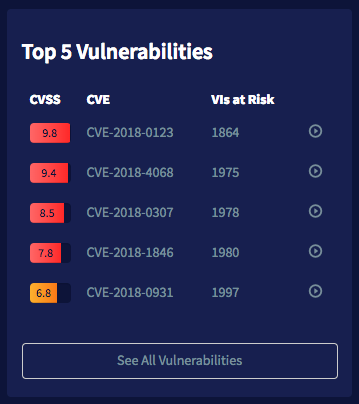

# Security: Top Vulnerabilities

## Description

Coming soon...

## Screenshot

## Additional Information/Notes

> None

## Installation

Download and install update set **[pe-top-vulnerabilities.u-update-set.xml](https://github.com/platform-experience/serviceportal-widget-library/blob/master/pe-top-vulnerabilities/pe-top-vulnerabilities.u-update-set.xml)**

After installation, the widget can be accessed via the `Service Portal > Widgets` section for use and customization.

* SN Product Documentation - ['Load a customization from a single XML file'](https://docs.servicenow.com/bundle/kingston-application-development/page/build/system-update-sets/task/t_SaveAnUpdateSetAsAnXMLFile.html)

## Configuration

> None

## Platform Dependencies

### SN System Tables

> None

## Sample Data and Data Structures

> See 'Configuration' above

## Dependencies

> None

## CSS/SASS Variables

_CSS/SASS variables are given default values that can be overridden with theming or portal-level CSS._

> None