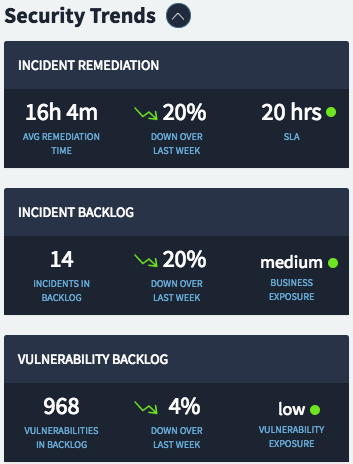

# Card Scroll

## Description

This widget can be used to quickly craft a card that scrolls on toggle to display hidden content.

## Screenshots

### Collapsed View


### Expanded View



## Additional Information/Notes

> None

## Installation

Download and install update set **[pe-angular-line-chart.u-update-set.xml](https://github.com/platform-experience/serviceportal-widget-library/blob/master/src/pe-card-scroll/pe-card-scroll.u-update-set.xml)**

After installation, the widget can be accessed via the `Service Portal > Widgets` section for use and customization.

* SN Product Documentation - ['Load a customization from a single XML file'](https://docs.servicenow.com/bundle/kingston-application-development/page/build/system-update-sets/task/t_SaveAnUpdateSetAsAnXMLFile.html)

## Configuration

> None

## Platform Dependencies

### SN System Tables

> None

### UI Dependencies

> None

## CSS/SASS Variables

_CSS/SASS variables are given default values that can be overridden with theming or portal-level CSS._

```scss
$pe-theme-color: #1c2432 !default;
$pe-header-color: #fff !default;
$pe-anchor-color: #68acd8 !default;
$pe-status-color-normal: #6ee520 !default;
```