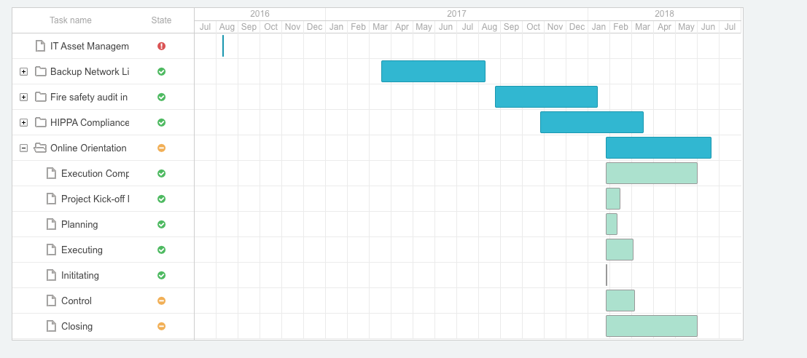
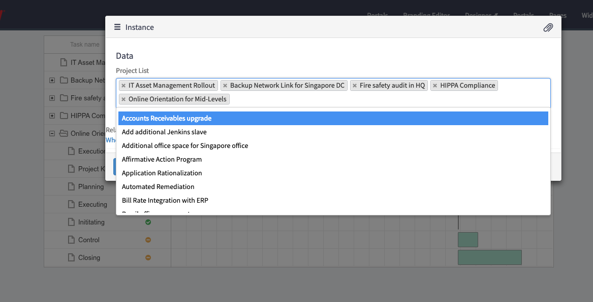

# Gantt Chart

## Description

This is used to create a simple Gantt Chart.

## Screenshot

## Additional Information/Notes

> None Claudia

## Installation

Download and install update set **[pe-gantt-chart.u-update-set.xml](https://github.com/platform-experience/serviceportal-widget-library/blob/master/src/pe-gantt-chart/pe-gantt-chart.u-update-set.xml)**

After installation, the widget can be accessed via the `Service Portal > Widgets` section for use and customization.

* SN Product Documentation - ['Load a customization from a single XML file'](https://docs.servicenow.com/bundle/kingston-application-development/page/build/system-update-sets/task/t_SaveAnUpdateSetAsAnXMLFile.html)

## Configuration

Widget Options Schema parameters:

**"Label"** Project List. `Default: Project List` 
**"Name"** Project List. `Default: project_list` 
**"Type"** Glide List. `Default: glide_list` 
**"Table"** Project. `Default: pm_project` 

## API Dependencies
<i>Dependencies are included and configured as part of the provided Update Set.</i>

* DHTMLX Gantt Chart API (v 6.1 - Recommended)  w/Export and No Data plug-ins
 Latest version(s) available from [DHTMLX Gantt](https://docs.dhtmlx.com/gantt/)

## CSS/SASS Variables

_CSS/SASS variables are given default values that can be overridden with theming or portal-level CSS._

> None
