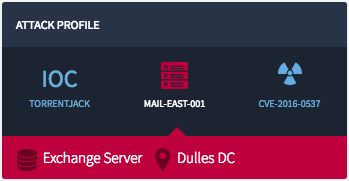
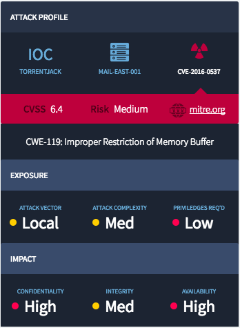

## Tab Selection Widget

## Description

This can be used to quickly craft a tab selection widget with an option.

## Screenshots
### Collapsed

### Expanded

## Additional Information/Notes 
> None
---
## Installation
Download and install update set **[pe-tab-selection.u-update-set.xml](pe-tab-selection.u-update-set.xml)**   
After installation, the widget can be accessed via the `Service Portal > Widgets` section for use and customization. 
* SN Product Documentation - ['Load a customization from a single XML file'](https://docs.servicenow.com/search?q=Load+a+customization+from+a+single+XML+file)   (<i>Select appropriate instance version</i>)

---
## Configuration
Widget Option Schema parameters:

**"Title"** This is for changing the title in the panel header.---
## Platform Dependencies
> None
---
## Sample Data and Data Structures
> None
---
## API Dependencies
<i>Dependencies are included and configured as part of the provided Update Set.</i>
> None
---
## CSS/SASS Variables
_CSS/SASS variables are given default values that can be overridden with theming or portal-level CSS._

`$pe-theme-color: #68acd8 !default;` 
`$pe-text-color: #fff !default;` 
`$pe-status-color-warning: #ffce00 !default;` 
`$pe-status-color-critical: #ff0050 !default;` 
