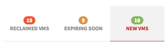

## Synopsis: Dynamic Tabs Widget



This can be used to quickly craft a tabs widget.

## Installation

Installation is very simple, you can just download the update set **pe-tabs-widget.u-update-set.xml** and install it on your instance. Then the widget is available for you to drag and drop on your page.

There is a sample JSON available in the UI script:

```javascript
firstTab: {
  name: 'Reclaimed vms',
  badgeNumber: 15,
  badgeColor: 'bg-red'
},
secondTab: {
  name: 'Expiring soon',
  badgeNumber: 5,
  badgeColor: 'bg-orange'
},
thirdTab: {
  name: 'new vms',
  badgeNumber: 10,
  badgeColor: 'bg-green'
}
```