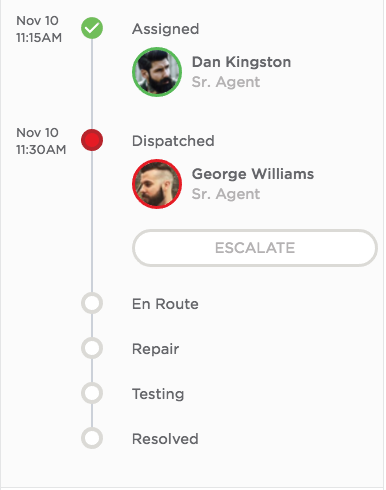

# Timeline Variant

## Description

This widget can be used to create a timeline with user avatar, name, title, etc.

## Screenshot

## Additional Information/Notes

This widget makes use of [pe-people-info](https://github.com/platform-experience/serviceportal-widget-library/tree/master/people-card/pe-people-info) widget to display user avatar, name and title, this widget is already part of the update set.

## Installation

Download and install update set **[pe-csm-timeline.u-update-set.xml](https://github.com/platform-experience/serviceportal-widget-library/blob/master/timeline/pe-csm-timeline/pe-csm-timeline.u-update-set.xml)**

After installation, the widget can be accessed via the `Service Portal > Widgets` section for use and customization.

* SN Product Documentation - ['Load a customization from a single XML file'](https://docs.servicenow.com/bundle/kingston-application-development/page/build/system-update-sets/task/t_SaveAnUpdateSetAsAnXMLFile.html)

## Configuration

### Widget Option Schema

| Option | Description | Default Value |
| :--- | :--- | :--- |
| `User SysID` | Set SysID | 9ec35b8713453a007e94fc5ed144b09a |
| `Show Only Picture` | Display picture only | false |
| `Show Job Title` | Display the job title | true |
| `Show Call and Chat` | Show the call and chat | false |

## Platform Dependencies

> None

## Sample Data and Data Structures

> None

## API Dependencies

*Dependencies are included and configured as part of the provided Update Set.*

> None

## CSS/SASS Variables

_CSS/SASS variables are given default values that can be overridden with theming or portal-level CSS._

> None