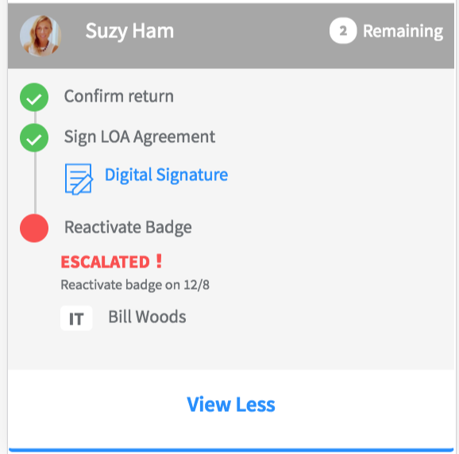

## Timeline - Variant Used In Employee Experience

## Description

This widget can be used to implement a timeline widget. A variation of the pe-timeline, used in Consumerize the Employee Experience.

## Screenshots


## Additional Information/Notes 
> None
---
## Installation
---
Download and install update set **[pe-timeline-emp-exp.u-update-set.xml](pe-timeline-emp-exp.u-update-set.xml)** <br/><br/>
After installation, the widget can be accessed via the `Service Portal > Widgets` section for use and customization.<br/>
* SN Product Documentation - ['Load a customization from a single XML file'](https://docs.servicenow.com/search?q=Load+a+customization+from+a+single+XML+file)   (<i>Select appropriate instance version</i>)

---
## Configuration
Widget Option Schema parameters:

**"Show Left Descriptions"** This is for displaying text on the left for each element in the timeline. This is set to false by default

---
## Platform Dependencies
> None
---
## Sample Data and Data Structures
The key "show" and its value decide how many timeline events to be shown in the widget, currently its set to 2, so only 2 events are shown; to view more you need to click on the "view more" button. "timelineArray" defines the number of timeline events. We have 3 events

```javascript
var timelineData = {
  show: 2,
  header: {
    text: 'Suzy Ham',
    color: '#a7a7a7',
    remaining: 2,
    userPic: 'eb16d7c713453a007e94fc5ed144b055.iix'
  },
  timelineArray: [{
    state: 'good',
    title: 'Confirm return'
  }, {
    state: 'good',
    title: 'Sign LOA Agreement',
    signature: true
  }, {
    state: 'attention',
    title: 'Reactivate Badge',
    attenText: 'Escalated',
    attenSubText: 'Reactivate badge on 12/8',
    dept: 'IT',
    contact: 'Bill Woods'
  }]
};
```
---
## API Dependencies
<i>Dependencies are included and configured as part of the provided Update Set.</i>
> None
---
## CSS/SASS Variables
_CSS/SASS variables are given default values that can be overridden with theming or portal-level CSS._

`$pe-timeline-items-color: #ff6f00 !default;`