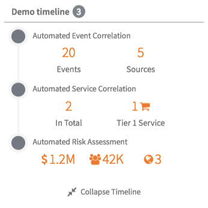
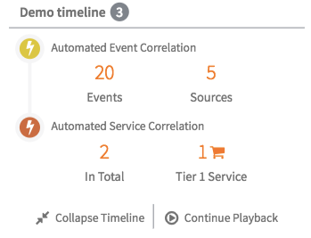
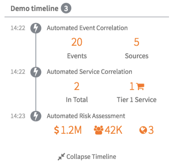
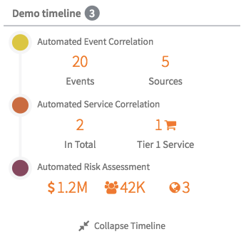

## Timeline

## Description

This widget can be used to quickly obtain an initial implementation of a timeline.

## Screenshots
### Collapsed

### Expanded

### Playback mode

### Show Icons and Show Colors set to True

### Show Icons set to False and Show Colors set to True

## Additional Information/Notes 
> None
---
## Installation
Download and install update set **[pe-timeline.u-update-set.xml](pe-timeline.u-update-set.xml)**   
After installation, the widget can be accessed via the `Service Portal > Widgets` section for use and customization. 
* SN Product Documentation - ['Load a customization from a single XML file'](https://docs.servicenow.com/search?q=Load+a+customization+from+a+single+XML+file)   (<i>Select appropriate instance version</i>)

---
## Configuration
Widget Option Schema parameters:

**"Title"** This is for changing the title in the header 
**"Show Icons"** This is for displaying the icons (font awesome or bootstrap) specified in the input data set, instead of the standard circle. 
**"Show Colors"** This is for displaying the colors specified in the input data set (attribute *color*), instead of the default one. 
**"Show Left Descriptions"** This is for displaying a text on the left for each element in the timeline. 
**"Initial Elements"** This is for defining how many elements displaying during the first visualization. 

---
## Platform Dependencies
> None
---
## Sample Data and Data Structures
> None
---
## API Dependencies
<i>Dependencies are included and configured as part of the provided Update Set.</i>
> None
---
## CSS/SASS Variables
---
_CSS/SASS variables are given default values that can be overridden with theming or portal-level CSS._

`$pe-timeline-items-color: #ff6f00 !default;`
