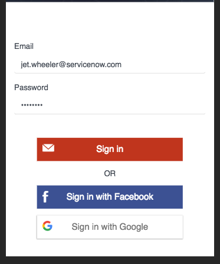

# End User Login

## Description

This can be used to quickly craft a login widget.

## Screenshot

## Additional Information/Notes
> None
---
## Installation
---
Download and install update set **[pe-enduser-login.u-update-set.xml](https://github.com/platform-experience/serviceportal-widget-library/blob/master/user-login/pe-enduser-login/pe-enduser-login.u-update-set.xml)**   
After installation, the widget can be accessed via the `Service Portal > Widgets` section for use and customization. 
* SN Product Documentation - ['Load a customization from a single XML file'](https://docs.servicenow.com/bundle/kingston-application-development/page/build/system-update-sets/task/t_SaveAnUpdateSetAsAnXMLFile.html)

---
## Configuration
---
### Widget Option Schema

| Option | Description | Default Value |
| :--- | :--- | :--- |
| `Table` | This is for changing the table that the default user is pulled from. | sys_user |
| `Email Address Field` | This is the field that we will pull the email address from for the login. | email |
| `Encoded Query` | This is for specifying a user, it will allow you to set the query for any parameters. | email!=NULL^GOTOnameLIKESystem Administrator |

---
## Platform Dependencies
> None
---
## Sample Data and Data Structures
> None
---
## API Dependencies
---
<i>Dependencies are included and configured as part of the provided Update Set.</i>
> None
---
## CSS/SASS Variables
_CSS/SASS variables are given default values that can be overridden with theming or portal-level CSS._
> None