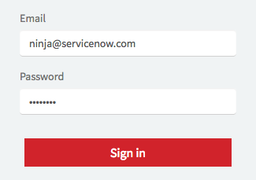

# User Login Widget

## Description

This widget can be used to quickly craft a user login.

## Screenshot


## Additional Information/Notes
> None
---
## Installation
---
Download and install update set **[pe-user-login.u-update-set.xml](https://github.com/platform-experience/serviceportal-widget-library/blob/master/user-login/pe-user-login/pe-user-login.u-update-set.xml)** <br/><br/>
After installation, the widget can be accessed via the `Service Portal > Widgets` section for use and customization.<br/>
* SN Product Documentation - ['Load a customization from a single XML file'](https://docs.servicenow.com/bundle/kingston-application-development/page/build/system-update-sets/task/t_SaveAnUpdateSetAsAnXMLFile.html)

---
## Configuration
Widget Option Schema parameters:
> None
---
## Platform Dependencies
> None
---
## Sample Data and Data Structures
> None
---
## API Dependencies
---
<i>Dependencies are included and configured as part of the provided Update Set.</i>
> None
---
## CSS/SASS Variables
---
_CSS/SASS variables are given default values that can be overridden with theming or portal-level CSS._

```scss
$pe-button-color: #d1232b !default;
$pe-button-state-color: #c42229 !default;
```